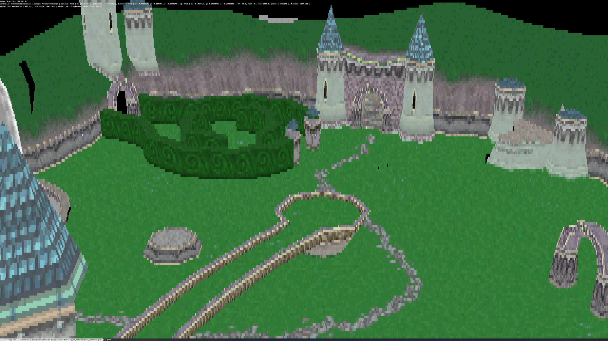

# [software-rasterizer](https://github.com/Vulae/software-rasterizer)

Displays `.glb` (glTF) scene inside the console window.

Felt bored, made this :)

Run: `cargo run -- "/path/to/model.glb"`

Controls:
- Left click to orbit
- Left click + right click to pan
- Scroll to zoom
- Arrow left & arrow right to roll
- Q or ESC to exit

## TODO

Donno if I'm going to keep working on this.
If I do, Here's a list of things I want to implement:
1. *Working* viewport clipping
2. Better orbit controls (Raycast into scene to pivot around that point)
3. Refactor screen to add multiple layers with opacity
4. Depth buffer
5. Use `crossterm` instead of `termion` (termion is buggy and bad)
6. Some sort of lighting (& maybe baked shadows?)

## Test Files

`.obj`: https://people.sc.fsu.edu/~jburkardt/data/obj/obj.html

`.glb`: `.glb` files re-exported from Blender 4.2.1:
- https://www.reddit.com/r/Spyro/comments/122ubg2/i_compiled_all_of_spyro_1s_levels_into_a/

